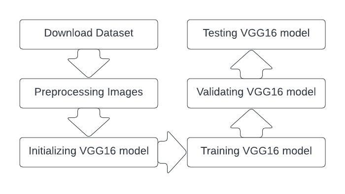
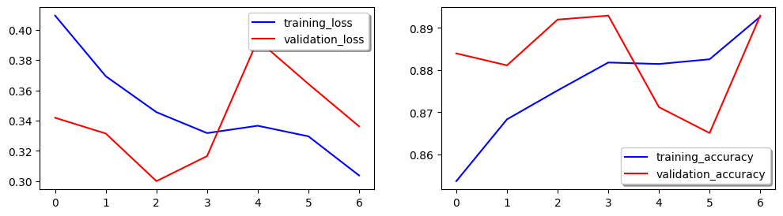
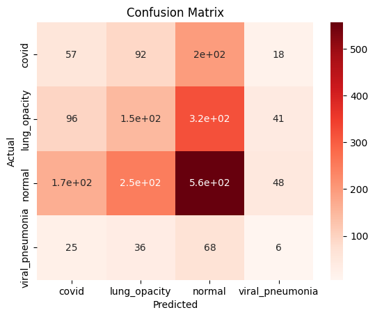
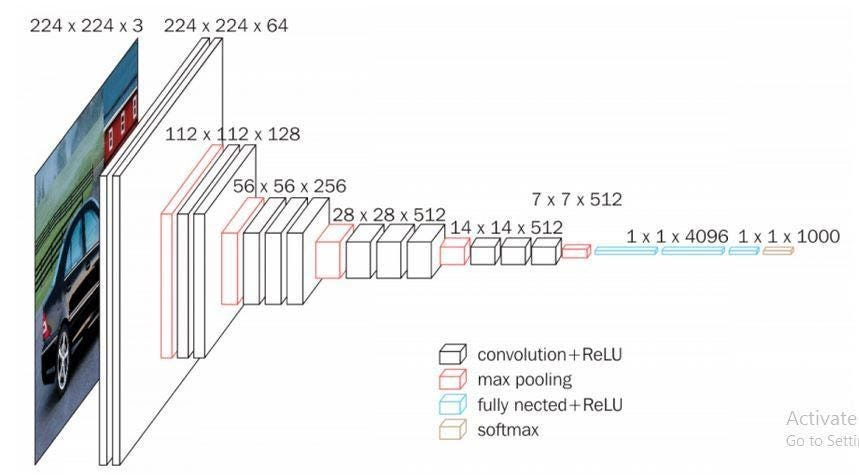
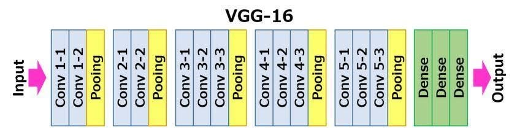

# kbs-vgg16-xray

COVID Chest X-ray Dataset [https://www.kaggle.com/datasets/tawsifurrahman/covid19-radiography-database](https://www.kaggle.com/datasets/tawsifurrahman/covid19-radiography-database)

## Steps

The objective of this project is to employ the VGG16 deep learning model in the analysis of radiographic images, aiming to accurately identify individuals who are infected with COVID-19.

The implementation consists of six steps: 1) Downloading dataset; 2) Preprocessing images 3) Initializing VGG16 model 4) Training VGG16 model; 5) Validating VGG16 model; 6) Testing VGG16 model.

## Transfer Learning

Transfer learning is a machine learning technique that involves leveraging knowledge gained from solving one problem to improve the learning or performance of another related problem. In transfer learning, a pre-trained model trained on a large dataset and a related task is used as a starting point or a feature extractor for a new task or dataset.

Instead of training a model from scratch, transfer learning allows us to take advantage of the knowledge already acquired by the pre-trained model. The pre-trained model, typically a deep neural network, has learned meaningful features from a vast amount of data, which can be generalized to other tasks or domains.

The process of transfer learning involves two main steps:

1. Pre-training: A deep neural network model, such as a Convolutional Neural Network (CNN) for image-related tasks, is trained on a large dataset (e.g., ImageNet) for a particular task, such as image classification. The model learns to extract meaningful features and develops a general understanding of the data.

2. Fine-tuning: The pre-trained model is then applied to a new, smaller dataset for a related task. The initial layers of the model, which capture general features, are usually frozen to preserve the learned knowledge. The latter layers, which capture more specific features, are adjusted or fine-tuned using the new dataset to adapt to the specific task.

Transfer learning offers several benefits:

1. Reduced training time: By utilizing pre-trained models, transfer learning can significantly reduce the time and computational resources required for training a model from scratch.

2. Improved performance: Transfer learning allows models to benefit from the knowledge learned on large-scale datasets, leading to improved performance on smaller or related datasets.

3. Overcoming data scarcity: When faced with limited labeled data, transfer learning enables the use of knowledge from larger datasets to generalize well to new datasets with fewer samples.

4. Generalization: Transfer learning helps models generalize better by leveraging learned features that capture generic patterns and characteristics across different tasks or domains.

Transfer learning has proven successful in various domains, including computer vision, natural language processing, and speech recognition. It has enabled significant advancements in areas such as image classification, object detection, and sentiment analysis, making it a valuable technique in machine learning and artificial intelligence research.

## VGG16

VGG16 is a convolutional neural network (CNN) architecture that was developed by the Visual Geometry Group (VGG) at the University of Oxford. It was introduced by Simonyan and Zisserman in their 2014 paper titled "Very Deep Convolutional Networks for Large-Scale Image Recognition."

The VGG16 architecture consists of 16 layers, including 13 convolutional layers and 3 fully connected layers. The key characteristic of VGG16 is its simplicity and depth. Unlike previous CNN architectures that had fewer layers, VGG16 increased the depth of the network by using small convolutional filters (3x3) with a stride of 1, and deeper networks were found to achieve better performance on image recognition tasks.

Here's an overview of the VGG16 architecture:

1. Input Layer: Accepts input images of fixed size (e.g., 224x224 pixels).

2. Convolutional Layers: The network consists of 13 convolutional layers, each followed by a Rectified Linear Unit (ReLU) activation function. These layers are responsible for learning hierarchical representations of the input images.

3. Max Pooling Layers: After each set of two convolutional layers, a max pooling layer with a 2x2 window and a stride of 2 is applied. This downsamples the feature maps, reducing spatial dimensions and providing translation invariance.

4. Fully Connected Layers: The final three layers are fully connected layers. The first two have 4,096 neurons each, while the last layer has 1,000 neurons, representing the output classes for the ImageNet dataset, which was the original dataset VGG16 was trained on.

5. Softmax Activation: The final layer uses a softmax activation function to produce a probability distribution over the output classes.

## Run the notebook in Colab
[https://colab.research.google.com/github/asfandyarsheikh/kbs-covid19-xray/blob/main/vgg16-xray.ipynb](https://colab.research.google.com/github/asfandyarsheikh/kbs-covid19-xray/blob/main/vgg16-xray.ipynb)

## Permalink
[https://kbs-vgg16-xray.asfandyar.ml/](https://kbs-vgg16-xray.asfandyar.ml/)

## References
[https://medium.com/@mygreatlearning/everything-you-need-to-know-about-vgg16-7315defb5918](https://medium.com/@mygreatlearning/everything-you-need-to-know-about-vgg16-7315defb5918)